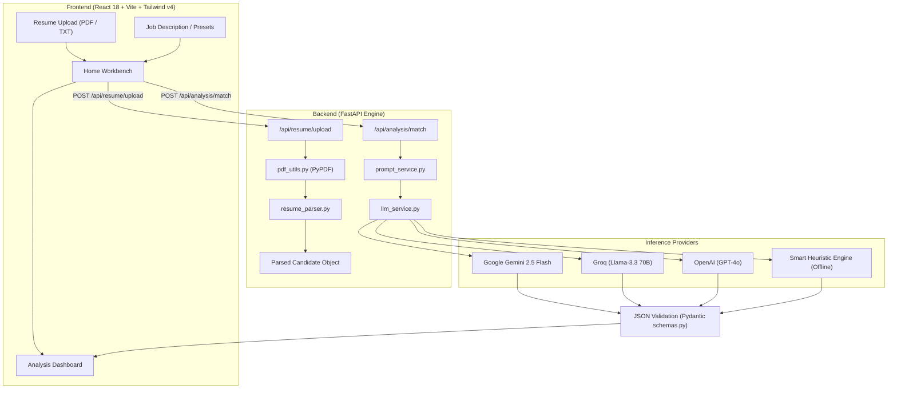

<div align="center">

# 📄 ResumeGPT

### 🚀 Next-Gen AI ATS Resume Analyzer, Matcher & Career Optimization Engine

[](https://github.com/shakyasagar166/ResumeGPT)
[](https://python.org)
[](https://fastapi.tiangolo.com)
[](https://react.dev)
[](https://vitejs.dev)
[](https://tailwindcss.com)
[](https://ai.google.dev)
[](https://opensource.org/licenses/MIT)

<p align="center">
  <b>ResumeGPT</b> is an end-to-end, full-stack AI platform that audits candidate resumes against real-world Job Descriptions (JD). Powered by <b>FastAPI</b>, <b>React 18</b>, <b>PyPDF</b>, and <b>Google Gemini / Groq / OpenAI</b>, it delivers real-time ATS match scores, deep keyword gap analysis, Google XYZ metric-driven bullet rewrites, and tailored interview prep questions.
</p>

[Explore Features](#-key-features) • [Quick Start](#-quick-start) • [Architecture](#-architecture) • [API Docs](#-api-endpoints) • [Contributing](#-contributing)

</div>

---

## 🌟 Key Features

<table>
  <tr>
    <td width="50%">
      <h3>📑 High-Fidelity PDF Parsing</h3>
      <p>Instant PDF & plain-text extraction with regex sanitization, contact identification (Email, Phone, LinkedIn, GitHub), and automated skill taxonomy classification.</p>
    </td>
    <td width="50%">
      <h3>🎯 4-Dimension ATS Scorecard</h3>
      <p>Calculates an overall ATS score (0-100) combining <b>Skills Alignment</b>, <b>Experience Relevance & Depth</b>, and <b>ATS Formatting/Readability</b>.</p>
    </td>
  </tr>
  <tr>
    <td width="50%">
      <h3>🔍 Keyword & Skill Gap Matrix</h3>
      <p>Visual chips breakdown: <b>Matched Skills</b> (green), <b>Missing Critical Skills</b> (red alerts for high-priority JD requirements), and <b>Nice-to-Have Skills</b>.</p>
    </td>
    <td width="50%">
      <h3>✍️ Google XYZ Bullet Rewrites</h3>
      <p>Automatically transforms passive bullets into metric-driven statements using Google's formula: <i>"Accomplished [X], as measured by [Y], by doing [Z]"</i>.</p>
    </td>
  </tr>
  <tr>
    <td width="50%">
      <h3>💡 Custom Interview Preparation</h3>
      <p>Generates targeted technical and behavioral interview questions based on the candidate's exact background gaps, complete with the recruiter's rationale and STAR response strategies.</p>
    </td>
    <td width="50%">
      <h3>⚡ Multi-LLM & Offline Fallback</h3>
      <p>Seamlessly switch between <b>Google Gemini 2.5 Flash</b>, <b>Groq (Llama-3.3 70B)</b>, <b>OpenAI (GPT-4o)</b>, or run 100% offline via the built-in <b>Smart Heuristic Engine</b>.</p>
    </td>
  </tr>
</table>

---

## 📂 Repository File Structure

```text
ResumeGPT/
│
├── backend/
│   ├── app/
│   │   ├── main.py                     # FastAPI server, CORS middleware & health check
│   │   │
│   │   ├── routes/
│   │   │   ├── resume.py               # PDF upload, parsing & sample resume routes
│   │   │   └── analysis.py             # Match analysis, quick scan & preset routes
│   │   │
│   │   ├── services/
│   │   │   ├── llm_service.py          # Gemini / Groq / OpenAI & heuristic fallback logic
│   │   │   ├── resume_parser.py        # Regex contact & skill taxonomy extractor
│   │   │   └── prompt_service.py       # Prompt loader and template interpolator
│   │   │
│   │   ├── models/
│   │   │   └── schemas.py              # Pydantic data schemas & response contracts
│   │   │
│   │   └── utils/
│   │       └── pdf_utils.py            # PyPDF text extraction & text sanitization
│   │
│   ├── requirements.txt                # Python backend dependencies
│   └── .env.example                    # Environment keys (Gemini, Groq, OpenAI)
│
├── frontend/
│   ├── src/
│   │   ├── components/
│   │   │   ├── ResumeUpload.jsx        # Drag-and-drop PDF upload & text switcher
│   │   │   ├── JobDescription.jsx      # Job description input & 1-click presets
│   │   │   └── AnalysisResult.jsx      # ATS score gauge, bullet rewrites & interview prep
│   │   │
│   │   ├── pages/
│   │   │   └── Home.jsx                # Main workbench coordinator
│   │   │
│   │   ├── App.jsx                     # Top navigation, status indicator & footer
│   │   ├── index.css                   # Glassmorphic dark UI styling + Tailwind v4
│   │   └── main.jsx                    # React 18 entrypoint
│   │
│   ├── package.json                    # React, Vite, Tailwind v4, Lucide Icons
│   └── README.md                       # Frontend documentation
│
├── data/
│   └── sample_resume.pdf               # Pre-generated sample resume for instant testing
│
├── prompts/
│   └── resume_analysis.txt             # Structured recruiter & ATS prompt template
│
├── run_backend.bat                     # 1-Click Windows Backend Launcher
├── run_frontend.bat                    # 1-Click Windows Frontend Launcher
├── .gitignore                          # Clean git ignore rules (venv, node_modules, .env)
├── README.md                           # Master GitHub documentation
└── LICENSE                             # MIT License
```

---

## 🏛️ System Architecture



---

## 🚀 Quick Start

### 1. Clone the Repository
```bash
git clone https://github.com/shakyasagar166/ResumeGPT.git
cd ResumeGPT
```

---

### 2. Backend Setup (FastAPI)

```bash
cd backend

# Create virtual environment
python -m venv venv

# Activate virtual environment
# Windows:
.\venv\Scripts\activate
# macOS/Linux:
source venv/bin/activate

# Install dependencies
pip install -r requirements.txt

# Configure environment variables
copy .env.example .env    # On Windows
# cp .env.example .env    # On macOS/Linux
```

Configure your API key in `backend/.env` (optional — works out of the box with the offline heuristic engine):
```env
LLM_PROVIDER=gemini
GEMINI_API_KEY=your_gemini_api_key_here
GEMINI_MODEL=gemini-2.5-flash
PORT=8000
```

Start the backend server:
```bash
python -m uvicorn app.main:app --reload --port 8000
```
- API is running at: **`http://localhost:8000`**
- Interactive Swagger UI: **`http://localhost:8000/docs`**

---

### 3. Frontend Setup (React + Vite)

In a new terminal:
```bash
cd frontend

# Install packages
npm install

# Start development server
npm run dev
```
Open **`http://localhost:5173`** (or `5175`) in your browser.

---

### ⚡ 1-Click Launch (Windows)

Simply double-click the included batch files:
- `run_backend.bat` ➔ Starts FastAPI server on port `8000`
- `run_frontend.bat` ➔ Starts Vite React server on port `5173`

---

## 📡 API Endpoints

| Method | Endpoint | Description |
| :--- | :--- | :--- |
| `POST` | `/api/resume/upload` | Upload `.pdf` or `.txt` resume and extract structured profile |
| `GET` | `/api/resume/sample` | Load pre-parsed `data/sample_resume.pdf` for 1-click testing |
| `POST` | `/api/resume/parse-text` | Parse raw pasted resume text |
| `POST` | `/api/analysis/match` | Full ATS match analysis, scoring, rewrites & questions |
| `GET` | `/api/analysis/presets` | Get industry preset job descriptions (Full Stack, AI, Frontend) |
| `POST` | `/api/analysis/quick-scan`| Rapid scoring calculation without full LLM generation |
| `GET` | `/health` | Server health check and configured LLM provider status |

---

## 📊 Sample Analysis Response

```json
{
  "candidate_name": "Alex Rivera",
  "target_role": "Senior Full Stack Engineer",
  "scores": {
    "overall_score": 85,
    "skills_match_score": 88,
    "experience_match_score": 82,
    "formatting_ats_score": 90,
    "summary_verdict": "Strong Match"
  },
  "matching_skills": ["Python", "FastAPI", "React", "PostgreSQL", "Docker", "AWS"],
  "missing_critical_skills": ["Kubernetes", "Distributed Systems"],
  "missing_nice_to_have_skills": ["GraphQL", "Terraform"],
  "bullet_point_improvements": [
    {
      "original": "Worked on backend APIs and bug fixes.",
      "improved": "Architected and deployed 15+ RESTful microservices using FastAPI and PostgreSQL, reducing API latency by 35% across 2M+ daily requests.",
      "improvement_reason": "Applies Google's XYZ formula: Accomplished [X], measured by [Y], by doing [Z]."
    }
  ]
}
```

---

## 🛠️ Tech Stack

- **Backend**: Python 3.10+, FastAPI, Uvicorn, Pydantic v2, PyPDF, ReportLab
- **AI & LLM**: Google GenAI SDK (Gemini 2.5 Flash), Groq API, OpenAI API
- **Frontend**: React 18, Vite 6, Tailwind CSS v4, Lucide React
- **DevOps**: Docker ready, Git, Windows Batch Scripts

---

## 🤝 Contributing

Contributions are welcome! Follow these steps:
1. Fork the Project (`git checkout -b feature/AmazingFeature`)
2. Commit your Changes (`git commit -m 'Add some AmazingFeature'`)
3. Push to the Branch (`git push origin feature/AmazingFeature`)
4. Open a Pull Request

---

## 📄 License

Distributed under the MIT License. See [`LICENSE`](LICENSE) for more information.

---

<div align="center">
  <b>⭐ Star this repo if you find ResumeGPT helpful!</b>
</div>
